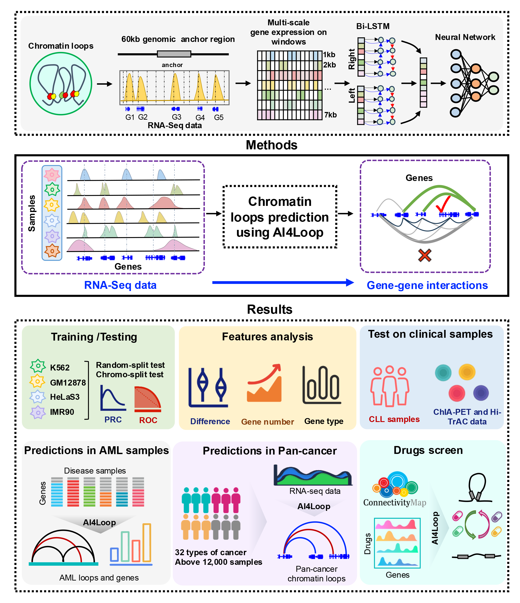

# AI4Loop

Gene-gene chromatin interactions (GGIs) bring distal genes into spatial proximity, leading to oncogene misregulation in cancer. High-throughput methods like Hi-C are impractical for large clinical cohorts, but RNA-Seq data from public repositories offer an alternative. Here, we developed AI4Loop to predict GGIs using only RNA-Seq data via deep learning. Using AI4Loop, we analyzed 12,000 TCGA samples across 32 cancer types, revealing a genome-wide landscape of GGIs with globally increased levels in most cancers, positively correlated with gene expression. We constructed a drug-perturbation GGI atlas of 50,000 samples across 42 cell lines, providing a resource for epigenetic drug research. Hi-C data validated that Eperezolid screened by AI4Loop led to GGI loss in cancer indeed, showcasing its potential for guiding drug selection.

