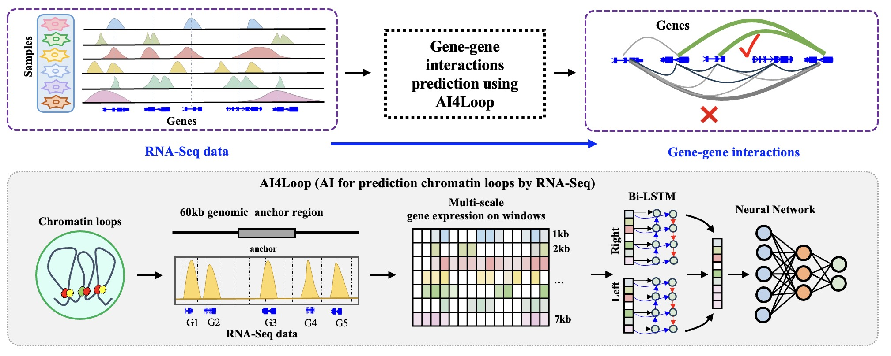

# AI4Loop: deep learning to predict chromatin interactions from RNA-Seq data


Gene-gene chromatin interactions (GGIs) bring distal genes into spatial proximity, leading to oncogene misregulation in cancer. High-throughput methods like Hi-C are impractical for large clinical cohorts, but RNA-Seq data from public repositories offer an alternative. Here, we developed AI4Loop to predict GGIs using only RNA-Seq data via deep learning. Using AI4Loop, we analyzed 12,000 TCGA samples across 32 cancer types, revealing a genome-wide landscape of GGIs with globally increased levels in most cancers, positively correlated with gene expression. We constructed a drug-perturbation GGI atlas of 50,000 samples across 42 cell lines, providing a resource for epigenetic drug research. Hi-C data validated that Eperezolid screened by AI4Loop led to GGI loss in cancer indeed, showcasing its potential for guiding drug selection.



### This document provides a brief intro of running models in AI4Loop for training and testing. Before launching any job, make sure you have properly downloaded the AI4Loop code and you have prepared the dataset with the correct format.

## Required Package
* Python3 (tested 3.8.13)
* tensorflow-gpu (tested 2.2.0)
* scikit-learn (tested 0.23.2) 
* pandas (tested 1.4.2) 
* numpy (tested 1.18.5) 
* bedtools2-2.25.0 
## Datasets
The models were trained on K562, GM12878, HeLaS3 and IMR90 Hi-C datasets separately. The data used to generate the datasets and build the modles are placed in the `data/` folder. We will walk through an example with GM12878 dataset.

### Data generation and preprocessing
The data generation and preprocessing scripts are placed under the `preprocess` directory.
The main entry script is `pipe.sh`. This script will process the interactions, cluster the interactions,
generate negative samples, generate distance-matched negative dataset.
```shell
mkdir out_dir
bash preprocess/pipe.sh data/GM12878_HiC_loop.bedpe \
                        data/v36Gene.bed \
                        data/GM12878_ctcf_ENCFF256QBB.bed \
                        gm12878_ctcf \
                        out_dir

```


