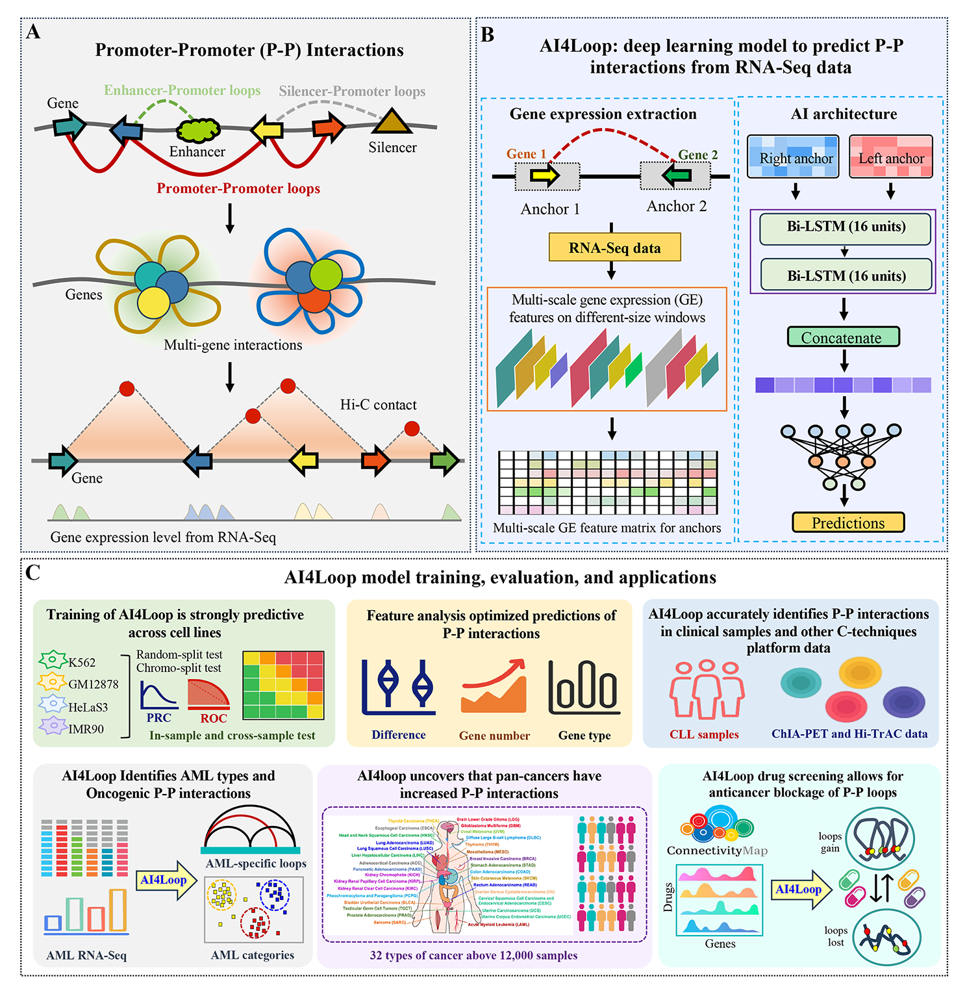

# AI4Loop: deep learning to predict chromatin interactions from RNA-Seq data

Changes in 3D chromatin interactions may represent actionable vulnerabilities in cancer, yet comprehensive profiling at scale remains technically and financially challenging. Here, we present AI4Loop, a deep learning framework that predicts genome-wide promoter-promoter chromatin interactions directly from RNA-Seq data. Applied to over 12,000 samples from 32 cancer types in TCGA, AI4Loop uncovered pervasive oncogenic promoter-promoter interaction gains that outperform gene expression in predicting cancer types. To investigate therapeutic potential, we constructed a large-scale drug-chromatin interactions atlas using 50,000 compound-treated gene expression profiles, identifying candidate compounds that reverse cancer-specific chromatin interactions. Notably, Hi-C experiment confirmed that antibiotics eperezolid and radezolid reduced cancer-gain chromatin interactions. Therefore, AI4Loop provides a scalable platform for decoding the 3D regulatory genome and enables novel opportunities for precision oncology and drug repurposing.



### This document provides a brief intro of running models in AI4Loop for training and testing. Before launching any job, make sure you have properly downloaded the AI4Loop code and you have prepared the dataset with the correct format.

## Required Package
* Python3 (tested 3.8.13)
* tensorflow-gpu (tested 2.2.0)
* scikit-learn (tested 0.23.2) 
* pandas (tested 1.4.2) 
* numpy (tested 1.18.5) 
* bedtools2-2.25.0 
## Datasets
The models were trained on K562, GM12878, HeLaS3 and IMR90 Hi-C datasets separately. The data used to generate the datasets and build the modles are placed in the `data/` folder. The details of the inputs to the script is shown below:
```shell
*_HiC_loop.bedpe #Interaction file in BEDPE format.
*_ctcf_*.bed #CTCF peak file in BED format which is downlowded from ENCODE.
genecode.v36Gene.map2.bed # gene information of human genome in BED format.
```
We will walk through an example with K562 dataset.

### Data generation and preprocessing
The data generation and preprocessing scripts are placed under the `preprocess` directory.
The main entry script is `pipe.sh`. This script will process the interactions, cluster the interactions,
generate negative samples, generate distance-matched negative dataset.
```shell
mkdir out_dir
bash preprocess/pipe.sh data/K562_HiC_loop.bedpe \
                        data/genecode.v36Gene.map2.bed \
                        data/K562_ctcf_ENCFF545EHA.bed \
                        k562_ctcf \
                        out_dir

```
### Distance-matched datasets
Take K562 cell line as an example, the final dataset `k562_ctcf_distance_matched.csv` is placed under the `out_dir` directory after following steps. The datasets used in this study are placed under the `datasets` directory.

```shell
python data_preparation.py -m 1000 -e 500 \
                      --pos_files out_dir/k562_ctcf.clustered_interactions.both_gene.bedpe \
                      --neg_files out_dir/k562_ctcf.neg_pairs_5x.from_singleton_inter_tf_random.bedpe \
                      -g hg19/hg19.fa \
                      -n k562_ctcf_distance_matched -o out_dir

python h5pyTodf.py k562_ctcf out_dir

```
## Extracting gene expression from RNA-Seq
The `callRNAseq.py` is used to extracte gene expression features from RNA-Seq data. Here we already preprocessed the RNA-Seq data of the cell lines and stored them in `data/allRNAseq.tsv`.
```shell
python callRNAseq.py k562_ctcf out_dir

```
## Training model with random-split test
The `trainBiLSTM.py` is used to train model based on random-split strategy. The models of different cell lines we trained in this study are placed under the `/models` directory. Take K562 cell line as an example here.

```shell
python trainBiLSTM.py k562_ctcf out_dir
```
## AI4Loop application - model prediction
We use the results of the third part of the paper "AI4Loop application in Acute Myeloid Leukemia (AML)" as an example to introduce the application of AI4Loop. In this part, we hope to find AML GGI from the K562 cell line. To this end, we first obtained all K562 gene pairs from the RNA-Seq of K562, and extracted the 1,000 gene pairs with the highest prediction probability through model prediction, so that we can avoid predicting the gene pairs of the whole genome for each sample and reduce the computational pressure.

Based on the 1,000 gene pairs, we applied AI4Loop to mine AML-related GGI as follows.In the `/prediction` folder, `Genepairs_1000.bedpe` is the gene pair file to be predicted, which can be generated from RNA-Seq data; `Samples_RNASeqdata.bed` is the RNA-Seq data of the sample, in the format of a BED file; `Samples_RNASeqdata.bed.columns.txt` is the corresponding column name file. After that, you can use the script `AI4LoopPrediction.py` for multi-threaded prediction. Please modify the relevant configuration according to the actual situation and run it. The file of prediction results is placed under `prediction` folder, named `Samples_RNASeqdata.bed.Pre.csv`.

```shell
python AI4LoopPrediction.py
```
## Citation and Contacts
If you use our code, data, or models, please cite "Artificial Intelligence Prediction of Gene-Gene Chromatin Interactions Across 12,000 Cancer and Normal Samples Reveals Elevated Interactions in Cancers", thank you very much. If you have any questions, please contact: fuying.dao@ntu.edu.sg.

## Acknowledgments
This research is supported by the National Research Foundation Singapore under the AI Singapore Programme (AISG Award No: AISG3-GV-2023-014) and by the Ministry of Education, Singapore under its Academic Research Fund Tier 1 Thematic (RT5/22), both awarded to M.J.F (PI). This research is also supported by the Singapore Ministry of Health’s National Medical Research Council under its Singapore Translational Research Investigator Award STaR (MOH-000709) awarded to G.B.C (PI) and M.J.F(Co-I).

## License
This software is released under the NTUitive Dual License. 
For non-commercial use only. For commercial use, please contact NTUitive.

