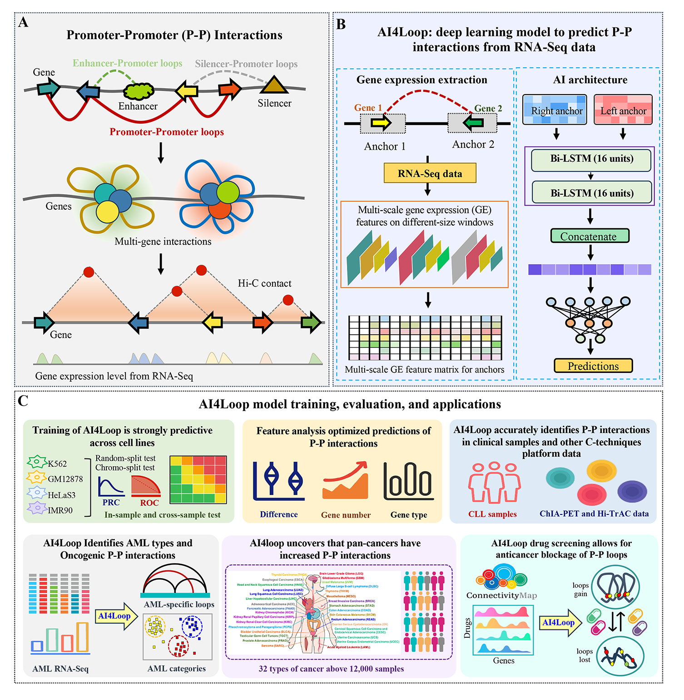

# AI4Loop

**AI4Loop** is an RNA-seq deep learning platform for predicting gene-centered chromatin interactions (GCIs) and identifying targetable chromatin interaction gains in cancer.

AI4Loop was developed to infer 3D chromatin interaction states directly from widely available transcriptomic data. The framework was trained and benchmarked using Hi-C-derived gene-centered interactions from K562, GM12878, HeLaS3 and IMR90, and can be applied to clinical RNA-seq cohorts and perturbational transcriptomic profiles where matched Hi-C, HiChIP or other chromatin conformation assays are usually unavailable.



## Key features

- Predicts gene-centered chromatin interactions directly from RNA-seq data.
- Provides pretrained models for K562, GM12878, HeLaS3 and IMR90.
- Supports random-split and chromosome-split evaluation to reduce performance inflation.
- Includes command-line workflows for RNA-seq feature extraction, model training, model evaluation and large-scale prediction.
- Supports pan-cancer and drug perturbation applications using TCGA-like RNA-seq profiles and LINCS-like perturbational expression profiles.
- Provides example input files, benchmark datasets and trained models for reproducibility.

## Repository structure

```text
AI4Loop/
├── data/                         # Reference files and example public datasets
├── datasets/                     # Processed benchmark coordinate datasets
├── models/                       # Pretrained AI4Loop models
├── prediction/                   # Example prediction inputs and outputs
├── preprocess/                   # Benchmark construction and negative sampling scripts
├── reproducibility/              # Notebooks/scripts for manuscript figures
├── utils/                        # Utility functions used by preprocessing scripts
├── extract_rnaseq_features.py    # Extract multi-scale RNA-seq features for candidate gene pairs
├── train.py                      # Train AI4Loop models with random/chromosome split
├── evaluate.py                   # Evaluate a trained AI4Loop model
├── predict.py                    # Predict GCIs from RNA-seq using a pretrained model
├── callRNAseq.py                 # Backward-compatible wrapper for extract_rnaseq_features.py
├── trainBiLSTM.py                # Backward-compatible wrapper for train.py
├── AI4LoopPrediction.py          # Backward-compatible wrapper for predict.py
├── requirements.txt
├── environment.yml
└── README.md
```

## Installation

### Option 1: Conda environment

```bash
conda env create -f environment.yml
conda activate ai4loop
```

### Option 2: pip installation

```bash
conda create -n ai4loop python=3.8
conda activate ai4loop
pip install -r requirements.txt
```

AI4Loop was originally trained with TensorFlow 2.2.0. For prediction-only use, newer TensorFlow CPU or GPU versions may work, but the original environment is recommended for exact reproducibility. The preprocessing workflow also requires `bedtools` and `pairToPair` from BEDTools.

## Pretrained models and recommended use

| Model | Recommended use | Rationale |
|---|---|---|
| `K562_RandomSplit.model.h5` | Leukemia-focused analyses, AML-related GCI discovery | K562 is a hematopoietic cancer-derived cell line. |
| `GM12878_RandomSplit.model.h5` | Default model for pan-cancer TCGA analysis and drug perturbation screening | GM12878 provides a deeply characterized lymphoblastoid reference context and avoids anchoring pan-cancer inference to a single tumor lineage. |
| `HeLaS3_RandomSplit.model.h5` | Cross-cell benchmarking and epithelial-context sensitivity analyses | HeLaS3 provides an epithelial cancer-derived reference. |
| `IMR90_RandomSplit.model.h5` | Cross-cell benchmarking and normal-fibroblast-context sensitivity analyses | IMR90 provides a fibroblast reference. |

For clinical CLL validation, both K562 and GM12878 models are biologically relevant reference contexts. For new datasets without a clear tissue-matched model, GM12878 is recommended as the default reference model, with cross-model robustness checks when possible.

## Input formats

### Candidate gene-pair file

AI4Loop supports the coordinate format used by the benchmark datasets:

```text
label,chr1,x1,x2,chr2,y1,y2
1,1,100000,105000,1,250000,255000
0,1,100000,105000,1,900000,905000
```

For prediction, AI4Loop also supports BEDPE-like files. If the file contains gene metadata, the first anchor should be in columns 1-3 and the second anchor in columns 6-8, as in `prediction/Genepairs_1000.bedpe`.

### RNA-seq BED file

RNA-seq input should be a BED-like file containing gene coordinates and one or more expression columns:

```text
chr1    start    end    gene_id    sample_1    sample_2
chr1    11869    14409  ENSG...    3.14        5.20
```

The example file is `prediction/Samples_RNASeqdata.bed`. If the RNA-seq BED file has no header, provide a separate column-name file with one column name per line, as in `prediction/Samples_RNASeqdata.bed.columns.txt`.

### Extracted feature matrix

Training and evaluation use a feature matrix with:

- a `label` column;
- left-anchor features beginning with `L`;
- right-anchor features beginning with `R`;
- optional coordinate columns `chr1`, `x1`, `x2`, `chr2`, `y1`, `y2` for chromosome-split evaluation.

## Quick start

### 1. Predict GCIs from example RNA-seq data

```bash
python predict.py \
  --model models/K562_RandomSplit.model.h5 \
  --gene_pairs prediction/Genepairs_1000.bedpe \
  --rnaseq_bed prediction/Samples_RNASeqdata.bed \
  --column_names prediction/Samples_RNASeqdata.bed.columns.txt \
  --output prediction/Samples_RNASeqdata.bed.Pre.csv \
  --threads 8
```

Output columns include the original gene-pair coordinates and one prediction score column per RNA-seq sample.

### 2. Extract RNA-seq features for model training

```bash
python extract_rnaseq_features.py \
  --pairs datasets/K562_ctcf_distance_matched.csv \
  --rnaseq_bed data/allRNAseq.tsv \
  --sample K562 \
  --output datasets/K562_ctcf_distance_matched.csv_winGEfea.csv
```

### 3. Train AI4Loop using a random split

```bash
python train.py \
  --features datasets/K562_ctcf_distance_matched.csv_winGEfea.csv \
  --output_model models/K562_example_random.model.h5 \
  --metrics_out results/K562_example_random.metrics.json \
  --split random \
  --epochs 30 \
  --batch_size 30 \
  --seed 42
```

### 4. Train AI4Loop using a chromosome split

```bash
python train.py \
  --features datasets/K562_ctcf_distance_matched.csv_winGEfea.csv \
  --output_model models/K562_example_chromosome.model.h5 \
  --metrics_out results/K562_example_chromosome.metrics.json \
  --split chromosome \
  --test_chromosomes chr4 chr7 chr8 chr11 \
  --epochs 30 \
  --batch_size 30 \
  --seed 42
```

### 5. Evaluate a pretrained model

```bash
python evaluate.py \
  --model models/K562_RandomSplit.model.h5 \
  --features datasets/K562_ctcf_distance_matched.csv_winGEfea.csv \
  --metrics_out results/K562_pretrained.metrics.json
```

## Benchmark dataset construction

The benchmark datasets were constructed by integrating Hi-C loop calls, RNA-seq data, CTCF ChIP-seq peaks and GENCODE gene annotations for K562, GM12878, HeLaS3 and IMR90.

Positive samples are Hi-C loops whose two anchors overlap distinct gene regions. Negative samples are generated from graph-based non-connected anchors, random CTCF-gene pairs, random gene-gene pairs and distance-matched gene pairs, while excluding known Hi-C interactions. The final benchmark datasets use an approximate positive-to-negative ratio of 1:5 and are restricted to intrachromosomal gene pairs within 5 kb to 2 Mb.

The preprocessing scripts are provided in `preprocess/`. A K562 example is:

```bash
mkdir -p results/preprocess_k562
bash preprocess/pipe.sh \
  data/K562_HiC_loop.bedpe \
  data/genecode.v36Gene.map2.bed \
  data/K562_ctcf_ENCFF545EHA.bed \
  k562_ctcf \
  results/preprocess_k562
```

The processed benchmark coordinate datasets used in the manuscript are provided in `datasets/`.

## Reproducibility notes

To address common sources of performance inflation and irreproducibility, the revised command-line scripts implement the following safeguards:

- no hard-coded paths are required for training, evaluation or prediction;
- random seeds are explicitly controlled;
- random-split evaluation uses stratified train/test splitting;
- chromosome-split evaluation can hold out chromosomes 4, 7, 8 and 11;
- AUROC and AUPRC are calculated from continuous prediction probabilities;
- PR baseline corresponds to positive-sample prevalence in the test set;
- metrics, ROC coordinates, PR coordinates and prediction files are written to user-defined output paths;
- model choice for downstream analyses is documented in the pretrained-model table above.

## Data availability

The repository includes small example files, processed benchmark coordinate files and pretrained models. Large public datasets used by AI4Loop are available from their original data portals, including ENCODE, TCGA, LINCS CMap and GEO. The drug-perturbed Hi-C datasets generated in the study are available under GEO accession `GSE287383`.

## Citation

If you use AI4Loop, please cite:

> Dao F., Lebeau B. et al. AI4Loop: a deep learning framework to reveal increased chromatin interactions in cancers that constitute therapeutic vulnerabilities across 12,000 samples.

The title and citation will be updated after publication.

## Acknowledgments

This research is supported by the National Research Foundation Singapore under the AI Singapore Programme (AISG Award No: AISG3-GV-2023-014) and by the Ministry of Education, Singapore under its Academic Research Fund Tier 1 Thematic (RT5/22), both awarded to M.J.F (PI). This research is also supported by the Singapore Ministry of Health’s National Medical Research Council under its Singapore Translational Research Investigator Award STaR (MOH-000709) awarded to G.B.C (PI) and M.J.F(Co-I), and the National Research Foundation, Singapore (NRF-PA2025-NTU; Award No. 026374-00004) awarded to F.D (PI).

## License

AI4Loop is released under the NTUitive Dual License. Academic and non-commercial use is permitted. For commercial use, please contact NTUitive.

## Contact

For questions, please contact Fuying Dao or open an issue in this repository.
